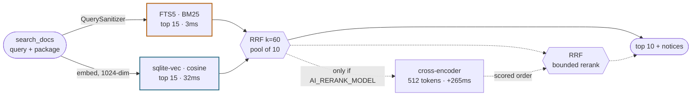
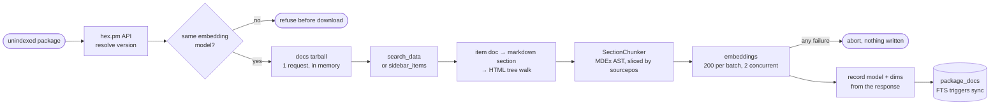

# Local Stdio MCP Server

A lightweight Elixir MCP server designed to run over `stdio` with a local SQLite database and an `AI_API_KEY`.

- `search_docs`: ask a question about an Elixir package; the tool answers from the local index, or downloads and digests the package first if it is not indexed yet. A first-time ingestion of a large package may exceed one tool call — the payload then reports progress and the job continues in the background.
- `list_indexed_packages`: what is indexed, at which version, whether it is complete, and how that compares to the version this project depends on.
- `remember`: save one or more learnings — takes a list, so a whole session's lessons go in a single call. AI assisted curation runs in the background and may merge, append to or discard what you send.
- `recall`: check your knowledge database
- `search_github_issues`: search a GitHub organization's issues and PRs, live. Not stored locally.
- check your LLM helper consumption with `get_token_usage`.

## Tech

- `SQLite` + FTS5 + `sqlite-vec`
- `anubis_mcp`: Compatible with Claude Code, Cursor, and Google Antigravity CLI (`agy`).
- `MDEx` for markdown (parsing and source positions — never rendering), `lazy_html` (Lexbor) for HTML extraction and per-function source links
- `Bumblebee` for the optional cross-encoding reranker (off by default)
- Cloud AI models (embeddings, chat-small, chat-medium).

>[!IMPORTANT]
> It uses AI support for computing embeddings and chat completions; you must provide an **AI_API_KEY** and three models.

 |Tool                                                        | Embeddings (/embeddings)                                   | Chat Model (/chat/completions) |
  |--|--|--|
  | search_docs                                                 | Yes (embed / embed_batch)                                  | No |
 | search_hex_packages                                         | No                                                         | No |
 | search_github_issues                                        | No                                                         | No |
 | recall                                                      | Optional — hybrid FTS+vector with a key, FTS5 only without  | No |
 |  remember                                                    | Yes (embed)                                                | Yes (small & large for taxonomy & deduplication)|

## Features

- **Hybrid search**: FTS5 and `vec_distance_cosine` retrieve in parallel, reciprocal rank fusion merges them, and an optional cross-encoder reranks. ~30ms; recall@10 is 1.00 on the eval set without the reranker, which is why it ships off.
- **Curated knowledge memory**: submissions are embedded, compared to their nearest neighbours, and only then passed to a chat model that chooses `create`, `append`, `merge`, `replace`, `deprecate` or `discard`. `recall` uses the same hybrid retrieval as `search_docs` — FTS5 and cosine fused by RRF — and degrades to keyword-only when no embedding is available, so it still works with no API key.
- **HexDocs ingestion**: fetches a package's docs tarball from Hex, extracts it in memory, and indexes it with embeddings on demand. One HTTP request per package, never a page-by-page crawl.
- **Version-aware**: with `PROJECT_ROOT` set, `latest` resolves to whatever your project's `mix.lock` pins — any age, pre-releases included — falling back to Hex's latest stable when nothing local pins the package. One version per package is kept, so results never interleave versions.
- **GitHub issues** are queried live against the GitHub API and are *not* stored locally.

## Tools

| Tool | Description |
| ------ | ------------- |
| `search_docs` | Search one Hex package's documentation, typespecs, guides and examples. `package` is required; ingests on demand. Results carry `hexdocs_url` and, for functions, a `source_url` pinned to the exact file, line and version |
| `list_indexed_packages` | List indexed packages, versions, completeness, and the version this project depends on |
| `search_hex_packages` | Find *which* package to use — Hex.pm names, descriptions, download counts |
| `search_github_issues` | Live GitHub API search for issues and PRs in an organization (not indexed) |
| `remember` | Save learnings to the local knowledge base. Takes `texts`, a list — batch a session's lessons into one call |
| `recall` | Search that knowledge base before re-investigating a failure |
| `get_token_usage` | AI token consumption recorded locally, by model and date range |

## Quickstart

### Prerequisites

- Elixir 1.20+
- An AI API provider key. Mistral has a generous free tier and is the default, so the key alone is enough to start; any OpenAI-compatible `/embeddings` and `/chat/completions` endpoint works via `AI_API_URL`.

SQLite needs no separate install — `ecto_sqlite3` bundles it — and neither does the vector extension: `sqlite_vec` ships the binary and `config/runtime.exs` loads it with `SqliteVec.path()`.

### Setup

Cloning is not the whole job. Five steps, and skipping any of the first three leaves a server that starts and then fails in a way that looks like a configuration problem.

**1. Dependencies and database**

```sh
mix setup
```

`mix setup` runs `deps.get`, `ecto.create` and `ecto.migrate`. The database path
is compiled in as `<this repo>/priv/mcp.db` — an absolute path, so it does not
depend on where you run the command from, and the server opens the same file
without being told. **Leave `DATABASE_PATH` unset** and setup and server cannot
disagree.

Set it only to give a project its own database, in which case set it *both* here
and in the MCP config, or you will migrate one file and read another.

> **One database is the normal case.** `PROJECT_ROOT` is per-project — each
> project's `.mcp.json` names its own repo — but they can all share the default
> database, and usually should: one `mix setup`, one index, no paths to keep in
> sync. Only one version per package is kept, so the cost appears in exactly one
> situation: two projects pinning *different* versions of the *same* package, which
> then re-ingests on each switch. The search says so when it happens, and the fix
> is a separate `DATABASE_PATH` for that project.

**2. Compile for `prod`, not `dev`**

```bash
MIX_ENV=prod mix compile
```

The MCP config below runs `mix mcp.server --no-compile` under `MIX_ENV=prod`, so a `dev` build does not satisfy it. This is also the step to repeat after *any* code change — and recompiling alone is not enough, the server must then be reconnected, because a running BEAM keeps the modules it already loaded.

**3. AI Coding assistant config file**

Copy `.mcp.example.json` (Claude Code, Cursor) or `.mcp_config.example.json`
(Antigravity) into the project you want to *use* the server from, and replace the
two ALL-CAPS placeholders.

**Two different directories are involved, and mixing them up fails silently.**

| placeholder | what it is | appears in |
| --- | --- | --- |
| `MCP_CLONE` | where you cloned **this** repo — the server has to run from here, because `mix` does not walk up directories to find `mix.exs` | the `cd` (or `cwd`), `MCP_LOG_FILE` |
| `YOUR_PROJECT` | the repo you are **editing** — the server reads its `mix.lock` to decide which version of a package to answer about | `PROJECT_ROOT` |

⚠️ Pointing `PROJECT_ROOT` at the clone rather than at your own repo is the easy
mistake, and nothing reports it: version resolution reads *this* project's
lockfile and answers confidently about the wrong versions.

The exception is working on `local_hex_mcp` itself, where the two directories are
the same one and `PROJECT_ROOT` may be omitted: with no lockfile configured,
resolution falls through to the versions loaded in the server's own BEAM, which
are that project's. The difference is that a mismatch between the index and your
deps is then *reported* rather than corrected, and `:application.get_key/2` only
sees started applications where `mix.lock` lists every one.

❇️ `AI_API_KEY` accepts any OpenAI-compatible provider; Mistral is the default.
Everything else has a working default — `AI_RERANK_MODEL`, `EMBED_BATCH_SIZE` and
the rest are in [Configuration](#configuration) and only worth setting once
something misbehaves.

**4. Copy the agent instructions**

➡️ Copy `CLAUDE.md` — or `AGENTS.md`, the same content under the name other assistants read — into that same project. It is what teaches the assistant that `package` is required, that a multi-package question is several calls, and how to read the `notices` field. Without it the tools work but are used badly.

**5. Warm the reranker** *(only if you enable it)*

The cross-encoder is **off by default** — nothing to download, and the setup is one step shorter. If you set `AI_RERANK_MODEL`, booting the app then loads that model (~20-100 MB from HuggingFace depending on which) and compiles it with EXLA. Both are cached afterwards, but on a cold machine they happen inside `Application.start/2` — that is, inside the window your MCP client is waiting for the server to come up. Do it once here, where you can watch it, to avoid a first connection that times out and looks broken:

```bash
AI_RERANK_MODEL=cross-encoder/ms-marco-MiniLM-L4-v2 mix run -e ":ok"
```

See [Search engine](#search-engine) for why it is off, and why leaving it off is the recommendation for an LLM client.

### AI Code Assistant Configuration

**Claude Code / Cursor** (`.mcp.json`):

```json
{
  "mcpServers": {
    "hex_local": {
      "command": "sh",
      "args": [
        "-c",
        "cd <MCP_CLONE> && exec /opt/homebrew/bin/mix mcp.server --no-compile"
      ],
      "env": {
        "MIX_ENV": "prod",
        "AI_API_KEY": "<your-key-here>",
        "MCP_LOG_FILE": "<MCP_CLONE>/tmp_logs.txt",
        "PATH": "/opt/homebrew/bin:/usr/local/bin:/usr/bin:/bin",
        "PROJECT_ROOT": "[/absolute/path/to/the/repo/you/are/editing]"
      }
    }
  }
}
```

**Google Antigravity** (`.agents/mcp_config.json`):

```json
{
  "mcpServers": {
    "hex_local": {
      "command": "mix",
      "args": ["mcp.server", "--no-compile"],
      "cwd": "/absolute/path/to/local_hex_mcp",
      "env": {
        "MIX_ENV": "prod",
        "MIX_QUIET": "1",
        "AI_API_KEY": "your-key-here",
        "PATH": "/opt/homebrew/bin:/usr/local/bin:/usr/bin:/bin",
        "PROJECT_ROOT": "/absolute/path/to/the/repo/you/are/editing"
      }
    }
  }
}
```

### Local embeddings

`AI_API_URL` addresses both `/embeddings` and `/chat/completions`, which assumes
one provider serves both. A local embedding server does not: it has no chat
route, so pointing `AI_API_URL` at it leaves `remember`'s curation calling a URL
that 404s — and `memory_enabled?/0` only checks that a key and a model name are
set, so it attempts the call rather than degrading. `AI_EMBED_URL` and
`AI_CHAT_URL` override the shared value independently; both default to it, so a
single provider still needs no extra configuration.

[`text-embeddings-inference`](https://huggingface.co/docs/text-embeddings-inference)
is in homebrew-core and exposes an OpenAI-compatible `/v1/embeddings`:

```bash
brew install text-embeddings-inference     # formula name
text-embeddings-router --model-id Qwen/Qwen3-Embedding-0.6B --port 8081
```

The binary is `text-embeddings-router`, not the formula name. First run downloads
the weights and does a warmup pass, both slow and both one-time.

```json
"AI_EMBED_URL": "http://localhost:8081/v1",
"AI_EMBED_MODEL": "Qwen/Qwen3-Embedding-0.6B",
"AI_API_KEY": "-",
"EMBED_BATCH_SIZE": "32",
"EMBED_CONCURRENCY": "1",
"EMBED_PAUSE_MS": "0"
```

**`EMBED_BATCH_SIZE` must not exceed TEI's `max_client_batch_size`** (32 by
default, printed at startup). Oversized batches are rejected, and the automatic
bisection will not rescue them: `token_overflow?/1` recognises the *provider's*
token-limit shape, and a client-batch-size rejection is a different error, so the
ingest aborts instead of halving. Match the two numbers.

`AI_API_KEY` only has to be non-empty; it is sent as a bearer token the local
server ignores. Chat keeps going to whatever `AI_API_URL` names, so `remember`
and `recall` are unaffected.

Three things to expect:

- **Switching embedders costs a full re-index**, and is refused until you run
  one. `embedding_config` compares the *model name*, not the dimension, which
  matters here: Qwen3-Embedding-0.6B is 1024-dim exactly like `mistral-embed`, so
  nothing would raise and cosine would simply return noise. `mix docs.reindex` is
  the supported path.
- **The first ingest of a large package will not finish inside one tool call.**
  That is the designed path, not a failure: the payload carries a
  "still being indexed" notice, the job keeps running, and calling `search_docs`
  again attaches to it. Drop `refresh: true` from the retry.
- **Lower `EMBED_CONCURRENCY`, do not raise it, and do *not* set
  `EMBED_PAUSE_MS` to zero.** Against a hosted provider the work is IO-bound and
  concurrency hides latency; against a local server the server *is* the
  bottleneck, so parallel requests only contend. `1` is the sensible value.

  The pause is the subtler one. There is no rate limit to pace against, but TEI
  processes sequentially on CPU whatever `max_concurrent_requests` claims, so
  **during an ingest every search's query embedding queues behind the ingest
  batches**. Measured on an M-series CPU with Qwen3-Embedding-0.6B: a 32-document
  batch takes 8-17s of inference, and a query issued behind one waited 8.4s,
  12.8s and 17.4s in `queue_time` for 48ms of its own compute. Long enough to
  exceed the MCP transport's 30s ceiling. `EMBED_PAUSE_MS` around `200` yields
  slots between batches so interactive searches get through; against a hosted
  provider, where requests genuinely run in parallel, `0` remains right.

Measured throughput on an M-series CPU (no Metal in the homebrew bottle):
**~244 tokens/s**, so a 32-document batch is 8-17s and a full 3967-chunk reindex
runs 25-30 minutes. That is a one-off, and it is the ingest side. **A single
query embedding is ~48ms of inference**, comparable to a round trip to a hosted
provider — search latency is not the thing to worry about here, contention is.

Whether it is any *good* is measurable rather than arguable, and this is the
argument for trying it: re-embedding locally is free, so `mix docs.eval` can
compare embedders the way it compared rerankers. The vector arm carries
conceptual retrieval (concept recall 0.94 against FTS's 0.88) and concept MRR at
0.65 is the weakest number in the table — the one axis never yet swept, because
until now every attempt cost API spend.

### Ingestion tuning

Set in the `env` block of your MCP config; they take effect on a server restart, with no recompile. A malformed value falls back to the default rather than raising.

| Variable | Default | Notes |
| --- | --- | --- |
| `INGEST_TIMEOUT_MS` | `25000` | How long a search waits for an in-flight ingestion. Must stay **below** the MCP transport's request ceiling (Anubis' session call gives up at 30s), or the request dies before the progress notice can be returned. |
| `EMBED_BATCH_SIZE` | `200` | Inputs per embeddings request. The provider limits *requests* per second, so larger batches reduce 429s. The real ceiling is tokens per request, but a token-limit rejection is bisected automatically, so this rarely needs tuning. |
| `EMBED_CONCURRENCY` | `2` | Concurrent embedding requests. Bounded by the Finch pool and the provider's rate limit — not by CPU count; the work is IO-bound. |
| `EMBED_PAUSE_MS` | `0` | Pause after each embedding request, for providers that limit requests per second. `0` means no pacing. Raise only if 429s persist after lowering concurrency. |

Everything else the server reads:

| Variable | Default | Notes |
| --- | --- | --- |
| $${\color{blue}\text{AI\_API\_KEY}}$$ | — | Required. `AI_API_URL` points at any OpenAI-compatible provider. |
| $${\color{blue}\text{PROJECT\_ROOT}}$$ | unset | Required. The repo being edited — **not** this clone. |
| DATABASE_PATH | `<this repo>/priv/mcp.db` | Leave it unset. The default is absolute and compiled in, so `mix setup` and the server agree by construction. Set it — in both places — only to give a project its own index. |
| `AI_EMBED_MODEL` | `mistral-embed` | Changing it invalidates the whole index; `mix docs.reindex` is the supported path. |
| `AI_CHAT_MODEL_SMALL` / `_LARGE` | `mistral-small-latest` / `mistral-medium-latest` | Structuring and curation for `remember`. |
| `AI_RERANK_MODEL` | unset | **Unset means no reranking** and no model is loaded at all. Set it to enable the stage; must be an architecture Bumblebee implements with a sequence-classification head. `cross-encoder/ms-marco-MiniLM-L4-v2` if you want one. A name that does not load logs an error and starts without reranking rather than failing to boot. |
| `AI_RERANK_STRATEGY` | `fused` | `fused`, `pure` or `gated` — how much authority the cross-encoder has over retrieval order. Ignored when `AI_RERANK_MODEL` is unset. |
| `GITHUB_TOKEN` | unset | Raises the rate limit for `search_github_issues`. |
| `MCP_LOG_FILE` / `MCP_LOG_LEVEL` | unset / `warning` | The only way to see anything: stderr is discarded by the client. |

> Changing code requires `MIX_ENV=prod mix compile` **and** reconnecting the MCP server — recompiling alone does not reload modules into a running BEAM.

### Telemetry

The tool `get_token_usage` returns the token consumption.

The query:

```bash
get_token_usage(from: "2026-08-01", until: "2026-08-01")
```

returns a clean human-friendly Markdown

<details>

<summary>example</summary>

```json
    {
      "total_requests": 12,
      "total_tokens": 10450,
      "total_prompt_tokens": 8200,
      "total_completion_tokens": 2250,
      "period": {
        "from": "2026-08-01",
        "until": "2026-08-01"
      },
      "by_model": {
        "mistral-embed": {
          "requests": 8,
          "prompt_tokens": 6500,
          "completion_tokens": 0,
          "total_tokens": 6500
        },
        "mistral-small-latest": {
          "requests": 4,
          "prompt_tokens": 1700,
          "completion_tokens": 2250,
          "total_tokens": 3950
        }
      }
    }
  ```

</details>  

### Optional: Litestream replication

Replicate your SQLite database to cloud storage (S3, B2, etc.) for backup and portability.

1. Install [Litestream](https://litestream.io/install/)
2. Configure replication for `DATABASE_PATH`

## Which version do you get?

The server runs from *its own* directory, so `:application.get_key/2` reports the
dependencies of `local_hex_mcp` and never the repo you are editing. Left at that,
`latest` falls through to Hex's latest stable, which may be a different major
line than your code compiles against — and nothing in the answer says so.

`PROJECT_ROOT` closes that. Point it at the repo you are working in and the
server reads that project's `mix.lock` itself:

```
explicit version:  ->  $PROJECT_ROOT/mix.lock  ->  the server's own BEAM  ->  Hex latest stable
```

| source | switches the index? | notes |
| --- | --- | --- |
| `version:` argument | yes | Explicit wins over everything. |
| `$PROJECT_ROOT/mix.lock` | **yes** | Authoritative for this project, and may point *backwards*. |
| the server's own BEAM | no — reports drift | An accident of where the server was launched, not a statement about you. |
| Hex latest stable | no — reports drift | Correct when nothing local pins the package. |

Read fresh on every lookup, never cached, so `mix deps.get` mid-session is
picked up without restarting the server.

**The lockfile may downgrade, deliberately.** A project on `boruta 2.3.0` gets
2.3.0 docs even though `3.0.0-beta.4` exists. Refusing to move backwards would
serve documentation for code the project does not run — silently, which is worse
than the re-ingest it costs. Pre-releases are equally fine: the lockfile is a
statement of fact, not a preference to be second-guessed.

**Only one version per package is kept.** Honouring a second project's lockfile
therefore evicts the first project's docs, and the search says so:

> Replaced indexed 'nimble_options' v1.1.1 with v1.1.0, which
> /path/to/mix.lock pins. Only one version per package is kept. If two projects
> share this DATABASE_PATH they will evict each other and re-embed on every
> switch — give each project its own DATABASE_PATH and PROJECT_ROOT.

A single switch is normal — you changed projects. Repeated switching means two
projects share a database, and that is a configuration problem no retry fixes.

**Without `PROJECT_ROOT`** the old rule applies: pass `version` yourself whenever
the answer must match your lockfile, or accept Hex latest stable.

## The embedding model is part of the index

Every vector must come from the same model. Two models are never comparable:
different dimensions make sqlite-vec raise, and *identical* dimensions raise
nothing at all while returning noise.

`embedding_config` records the model and dimension actually used, read from the
provider's response at ingest time. From that:

- **Ingestion refuses** to write vectors from a different model, before
  downloading anything.
- **Search disables the vector arm** on a mismatch and returns a notice, instead
  of raising into a rescue and silently degrading to keyword-only.
- **`list_indexed_packages`** reports `index_model`, `dims`, `query_model` and
  `matches_config?`.

So changing `AI_EMBED_MODEL` always costs a full re-embed of every package —
that is a property of embeddings, not of this storage. `mix docs.reindex` is the
supported way to do it.

## Maintenance tasks

| Task | What it does | Costs |
| --- | --- | --- |
| `mix docs.drift` | Re-derives every package's chunks from its tarball and compares to what is stored. Answers "would a refresh change anything?" | One download per package, **no embeddings** |
| `mix docs.reindex` | Re-downloads and re-embeds every indexed package under the current model. The supported way to change `AI_EMBED_MODEL`. | Full re-embed |
| `mix docs.sources` | Backfills `source_url` on rows indexed before that column existed. | One download per package, no embeddings |
| `mix docs.eval` | Retrieval benchmark over a fixed query set: `recall@5`, `MRR@10`, candidate recall, per arm. `--show N` prints the documents each query actually returned. | One embedding per query |
| `mix docs.judge` | Writes `priv/eval/judgements.md` — what the server returned, for a human to mark relevant or not. `mix docs.eval --judged` then scores precision rather than a single guessed target. | One embedding per query |

The reflex after changing the chunker is to re-index everything. `mix docs.drift`
is the cheap check that usually says you do not have to.

## Knowledge curation

`remember` does not simply append. Each submission is embedded, compared against
its nearest stored neighbours, and — when one is close enough to be worth
thinking about — passed to a chat model that decides what to do with it.

| Action | When | What happens |
| ----------- | ------------------------------------------------------- | --------------------------------------- |
| **create** | No similar neighbors (similarity < 0.8) | New entry |
| **discard** | Too similar (> 0.9), no additional value | Do nothing |
| **append** | Similar neighbor, new info adds value | Concatenate to existing content |
| **merge** | Overlapping but complementary info | Synthesize old + new into one entry |
| **replace** | Old info is factually wrong/superseded | Replace content of existing entry |
| **deprecate** | Neighbor is outdated by new info | Mark old as `outdated=true` |

Two thresholds govern it. Below `@similarity_threshold` (0.8) nothing reaches the
LLM: the entry is created directly and flagged `curated: false`, which is what
makes the floor auditable rather than a guess. Above `@duplicate_threshold` (0.9)
a submission carrying no new fact is discarded.

The floor was 0.7 and that was too low to mean anything. Measured over 91 pairs
of *known-distinct* entries: median similarity 0.738, maximum 0.943, and 73%
cleared 0.70 — so the gate fired on three quarters of all pairs, none of them
duplicates, and every submission reached the large model. Cosine similarity on
prose measures topic, and a knowledge base that is all "Elixir debugging
findings" is one topic. At 0.80 that drops to 19%.

It errs low on purpose. A threshold set too low costs one model call and the LLM
then correctly answers `create`; set too high, a real duplicate never reaches the
LLM and is stored forever. Cheap and self-correcting beats permanent.

Curation is asynchronous — `remember` returns a `request_id` per entry in
milliseconds and the work happens in a background task, in order. `texts` takes a
list precisely so a session's worth of lessons is one call: repeated calls buy no
parallelism (an Anubis session holds one request in flight) and firing several
concurrently is a reliable way to collect 429s.

## Search engine

A query runs two stages: two retrieval arms in parallel, then reciprocal rank
fusion. Roughly 30ms end to end once the query embedding returns. A third stage,
a cross-encoder, is available and **off by default** — see below for why.



**The fusion is where the retrieval quality comes from.** It unions the two arms
— a *union*, not an intersection, so a document the keyword arm never matched can
still be returned. Measured on the 28-query set, that union is worth 0.07 of
recall@10 over either arm alone, because the arms fail differently:

```
28 queries · corpus 11 packages / 3891 rows

                       recall@10   MRR@10   candidate   ms
FTS alone                 0.93      0.67       0.93       4
vector alone              0.93      0.75       1.00      37
RRF over both             1.00      0.75       1.00      28
```

The corpus fingerprint is printed with every run and is part of the result:
FTS5's `bm25()` uses collection-wide statistics, so indexing *any* package shifts
the keyword ranking of queries in every other one. A table built on a different
corpus is not a valid comparison.

### Why the cross-encoder is off

It never adds recall. RRF's candidate recall is already 1.00, so the stage can
only reorder a pool that already contains the answer — and with `limit` at 10 and
a rerank depth of 10, it reorders exactly the set that is returned. It cannot add
or remove a document.

That matters because of who reads the output. `search_docs` answers an LLM that
reads every row before replying, so it ranks the payload itself; rank *within* the
payload is close to worthless, while a document that never arrives cannot be
recovered without a second round trip. Those are the two columns the stage trades
between:

```
                                recall   MRR    ms
RRF, top 10, no reranker          1.00   0.76    46
RRF, top 5,  no reranker          0.96   0.76    44
RRF, top 5  + MiniLM-L4           0.96   0.81   294
RRF, top 5  + TinyBERT-L2         0.93   0.81    69
```

Returning ten unranked beats reranking five on the axis that survives the
consumer, at a sixth of the latency, and skipping it removes a HuggingFace
download and an EXLA compile from `Application.start/2`.

Set `AI_RERANK_MODEL` to turn it back on — a client that reads only the first
result wants it, and it is worth +0.05 MRR when rank does matter. `MiniLM-L4-v2`
is the one to pick: it matches larger models on every measured number, and unlike
`TinyBERT-L2-v2` it does not drop a query.

### What the cross-encoder does when enabled

**Fusion then happens twice.** The second pass fuses the cross-encoder's ordering
with the one retrieval produced, so the model can move a document but not
overrule the search outright.

Concretely, the second fusion is **rank averaging**: both inputs hold the same
ten documents, so each contributes `1/(60 + rank)` twice and the result orders by
something very close to the sum of the two ranks. Nothing cleverer than that.

The case it was built for: on `"prevent interception of the authorization code on
a public client"`, all three retrieval arms put boruta's PKCE guide at rank 1 and
the cross-encoder dropped it to 8, preferring a typespec that lists
`pkce: boolean()` among thirty fields. Averaging the two rankings puts it back
at 2.

**How well this generalises is not established.** Against the 26-query set,
fusing rather than letting the cross-encoder win outright moves 9 queries: five
improve, four worsen, and every movement is one rank except the PKCE case that
motivated the change. Remove that query and the effect is exactly zero. The
aggregate difference (recall@5 0.92 → 0.96) is one query, and one standard error
at this sample size is 0.043 — so the number is indistinguishable from noise.

It is kept on the mechanistic argument rather than the measurement: a bi-encoder
and a cross-encoder fail differently, so averaging their ranks is the standard
response to two rankers with uncorrelated errors. Treat it as unvalidated until
the query set is large enough to test it.

### Query, step by step

1. **Embed the query** — one API call, 1024 dimensions. The only network hop in a
   warm query.
2. **Ensure the package is indexed** — an unknown package triggers ingestion
   inline (below); a known one costs one row lookup and no network.
3. **Verify the embedding model** — if the index was built by a different model,
   the vector is dropped and a notice says so. Vectors from two models are not
   comparable: different widths make sqlite-vec raise, identical widths return
   noise while raising nothing.
4. **Scope** — package, version and the examples-only filter are applied to a
   base query that *both* arms join, so the depth budget is never spent on other
   packages.
5. **Keyword arm** — `QuerySanitizer` quotes each term as an FTS5 phrase and
   expands identifier-shaped terms into joined *and* split forms, so
   `Boruta.Oauth.token/2` searches for the exact symbol and its parts. BM25 order,
   top 15.
6. **Vector arm** — cosine distance over the scoped rows, top 15. This is the arm
   that bridges vocabulary gaps.
7. **Fuse to ten** — each arm contributes `1/(60 + rank)`; an absent document
   contributes nothing.
8. **Hydrate in fused order** — `id IN (…)` returns storage order, so the ranking
   is reimposed afterwards.
9. **Rerank, if enabled** — with `AI_RERANK_MODEL` set, the cross-encoder reads
   each query/document pair together and emits one relevance logit; the result is
   fused with step 7's order. Skipped entirely otherwise, and `Reranker.rerank/2`
   returns the fused order untouched when the serving is not running.
10. **Return ten** — the whole pool. Cutting to five drops a document the arms
    did find (recall 0.96 against 1.00), and the consumer reads every row anyway.

### Ingestion

Runs inline on the first search naming a package. One HTTP request for the docs,
nothing written to disk.



Notable decisions:

- **A stored version that differs from the current release is reported, never
  silently replaced.** Auto-switching would let one unpinned search discard a
  pinned version and force a full re-embed to get it back.
- **The model guard runs before the download.** A mixed-model index cannot be
  repaired by searching harder, and refusing costs one row read where proceeding
  costs a tarball plus a full re-embed.
- **Chunking is structural, not byte-based.** Boundaries fall on headings, then
  blocks, then list items, with a byte splitter kept only as the floor for a
  single oversized code block. Navigation sections — link lists made of the very
  titles people search for — are dropped. Nothing overlaps: text is sliced from
  the original markdown by source position, so what is stored is byte-identical
  to what the package published.
- **Embedding failure aborts before a single row is written.** Rows without
  vectors produce an index that looks complete, passes every count check, and is
  invisible to semantic search.

### Why the depths are what they are

Every number was measured against a fixed 26-query set (`mix docs.eval`). Three
are counterintuitive.

| Setting | Value | Why not more |
| --- | --- | --- |
| per-arm depth | 15 | Deeper is **worse**. RRF scores agreement, so at depth 40 an item ranked ~15 by both arms (`1/75 + 1/75`) outscores one ranked 3rd by a single arm (`1/63`), and the strong single-arm hit falls out of the pool. recall@5 drops 1.00 → 0.96 purely by retrieving more. |
| rerank pool | 10 | Retrieval wants depth; reranking does not. Candidate recall is already 1.00 at ten, so everything beyond is a distractor the model can mis-promote and nothing it can find. |
| sequence length | 512 | At 128 the pair truncates to ~400 characters. Symbol queries survive — the identifier is in the header — while conceptual answers sit deeper in the chunk and are never seen. Reranking at 128 scored *worse than not reranking at all*. |

Two properties worth knowing before trusting a measurement:

- **BM25 is corpus-global.** FTS5 uses collection-wide document frequency, so
  indexing any package shifts the keyword ranking of queries in *other* packages
  — measured, 53 new rows moved the keyword arm by 0.04 with nothing else
  touched. Vector search is immune. A control table is only valid for the corpus
  that produced it, which is why the report prints a corpus fingerprint.
- **Bigger rerankers are not better here.** `bge-reranker-base` (278M) scores
  0.78 MRR against MiniLM-L-6's 0.79 and is five times slower;
  `ms-marco-MiniLM-L-12-v2` loses two queries outright. Selectable via
  `AI_RERANK_MODEL`.

### When a stage fails

Every stage degrades to the one beneath it. None is an error the caller handles.

| Condition | Behaviour |
| --- | --- |
| No API key, or the index was built by another model | Keyword search alone, with a notice naming the fix |
| Cross-encoder not loaded, or its output unrecognised | Fused retrieval order, logged |
| Keyword terms match nothing | The vector arm carries the fusion alone |
| Both arms empty | No results — not an exception |
| Ingestion outruns the request budget | A progress notice; the job keeps running and the next identical search collects it |

### Measured

26 queries — 14 conceptual, 12 bare identifiers — over 10 packages and 2,755
chunks. `cand` is the share of queries whose candidate pool contained the answer
at all, and is the ceiling on everything downstream.

| Strategy | recall@5 | MRR@10 | cand | ms |
| --- | --- | --- | --- | --- |
| keyword only | 0.88 | 0.67 | 0.96 | 3 |
| vector only | 0.88 | 0.76 | 1.00 | 32 |
| intersection (previous design) | 0.92 | 0.79 | 0.96 | 31 |
| fusion | 0.92 | 0.76 | 1.00 | 28 |
| **fusion + bounded rerank** | **0.96** | **0.79** | **1.00** | **398** |

Split by query shape the last row reads very differently: `1.00 / 1.00` on bare
identifiers, `0.93 / 0.60` on conceptual questions. The reranker pulls
conceptual answers *into* the top five that retrieval missed, while ordering them
worse than plain retrieval does. Bounding its authority recovered the recall; the
ordering gap is the open problem.

Reproduce with `AI_API_KEY=... mix docs.eval --verbose`. A change that does not
move these numbers did not work, whatever it looked like in a spot check.

### On the latency budget

400ms is not instant, and that is fine — but not for the reason it first appears.

A single assistant turn is seconds of token generation, so 400ms is noise against
it. The mechanism that actually matters is not a gradient of patience but a
**hard wall**: Anubis' session `GenServer.call` gives up at 30s and the client has
its own tool timeout. Below the wall, latency costs nothing behavioural; above it
the call dies. So the tail is what needs protecting, not the median — a 400ms
median with a 26s cold-ingest tail is a worse risk profile than a 900ms median
with a 3s tail. That is why `INGEST_TIMEOUT_MS` sits at 25s with a progress
notice, rather than the pipeline simply being fast on average.

What justifies spending latency is that cost compounds through **retries**, not
through the call. If the tool answers, the agent moves on; if it does not, the
agent reformulates — a second tool call plus a whole extra model turn. A 400ms
call that answers is much cheaper than a 50ms call that forces a second turn.
Against that, the reranker's 390ms buys recall@5 from 0.92 to 0.96: one query in
26 that no longer needs a retry. If a retry costs ~3s of model turn, it pays for
itself above roughly a 4% retry-avoidance rate, and 0.04 is what was measured.

The operating rule, then, is close to the opposite of "keep it snappy": **spend
the median freely up to the wall when it buys correctness, and protect the tail
absolutely.** Concurrency is not a factor, and not for the reason you might
expect: an Anubis session holds one request in flight and queues the rest, so
parallel tool calls are serialised before they ever reach the reranker. What that
does mean is that a slow request consumes the timeout budget of everything queued
behind it — see "One call at a time" below.

## Worked examples

Both of these are real questions from a session where the answer was genuinely
unknown, and both are now regression queries in `mix docs.eval`. You do not call
the tool yourself — you ask a normal question and the assistant decomposes it.

### A question with no answer in your training data

```txt
can an MCP server ask the client's LLM to run a completion, and does
anubis support it?
```

The assistant issues one call, using the vocabulary the package's own docs would
use rather than the words in the question:

```elixir
search_docs(package: "anubis_mcp",
            query: "server requests a completion from the client model, sampling create message")
```

It returns `Anubis.Server.send_sampling_request/2` (server side),
`Anubis.Client.register_sampling_callback/2` (client side), the guide section
that explains sampling alongside roots and elicitation, and the callback's return
shape — with a citable `hexdocs_url` on each.

### A question whose answer shares no words with it

```txt
how do I check the client declared a capability before sending it a request?
```

```elixir
search_docs(package: "anubis_mcp",
            query: "check whether the connected client declared a capability before sending a server request")
```

Rank 2 is `Anubis.Server.send_elicitation_request/3`, whose docstring happens to
carry the rule for *all three* server-initiated request kinds:

> The client must advertise the `elicitation` capability or the call returns
> `{:error, :capability_not_supported}` after enqueueing.

Nothing in the query lexically matches that function — no shared identifier, no
shared phrasing. That is the vector arm doing the one thing BM25 structurally
cannot, and it is the case the whole hybrid pipeline exists for.

### What it does not tell you

Both answers above are correct. Extrapolating from them was not: the docs say
`roots` is supported and Claude Code advertises it, so sending a `roots/list`
request looks safe — and it deadlocks the stdio transport in anubis_mcp 1.14.0,
because `ServerRequests.send_to_transport/3` calls back into a transport already
blocked on the session.

`search_docs` tells you what a library **says**, reliably and with a citation. It
cannot tell you what it **does** under your transport, at your concurrency, in
your session. Interactions between processes are in no docstring.

### One call at a time

An Anubis session holds one MCP request in flight and queues the rest
(`Session.Scheduler.enqueue_or_dispatch/5` dispatches only when `in_flight` is
`nil`). Tool calls are therefore serialised, and issuing several in parallel buys
nothing.

It costs something, though: the transport's `GenServer.call(session, …, 30_000)`
starts its clock when the request is *sent*, not when it is dispatched, so a slow
request burns the budget of everything queued behind it. A 25s ingest leaves a
queued search roughly 5s before its own transport call times out. This is the
main reason `INGEST_TIMEOUT_MS` sits below the transport ceiling rather than at
it.

For tools called repeatedly in one turn — `remember` especially — take an array
and iterate inside a single call rather than relying on parallel invocations that
cannot happen.

### Multi-package questions

A search is scoped to **one** package, so a question spanning several becomes
several calls, each written in that package's own vocabulary:

```elixir
search_docs(package: "anubis_mcp", version: "1.14.0",
            query: "StreamableHTTP Plug router forward authorization")

search_docs(package: "boruta", version: "3.0.0-beta.4",
            query: "authorize access token bearer Plug protect resource")
```

Sending the same sentence to both matches neither well. Any package not already
indexed is downloaded, chunked and embedded first.

## Appendix: example model choices

Any provider exposing OpenAI-compatible `/embeddings` and `/chat/completions`
works; set `AI_API_URL` and the three model names. Prices drift — treat these as
a shape, not a quote.

|Model|Mistral / cost|OpenAI /cost|Gemini /cost|
|--|--|--|--|
|Embeddings|mistral-embed 0.1 /M|txt-embedding-3-small 0.02 /M|text-embedding-004 0.025 /M|
|Fast extraction|mistral-small-4 0.15/0.60|GPT-5-nano 0.05,0.40 /M|gemini-2.5-flash-lite 0.10,0.40 /M|
|Classification|mistral-large-3 0.50/1.50|GPT-5-mini 0.25,2.00 /M|gemini-3.1-flash-lite 0.25,1.50 /M|
