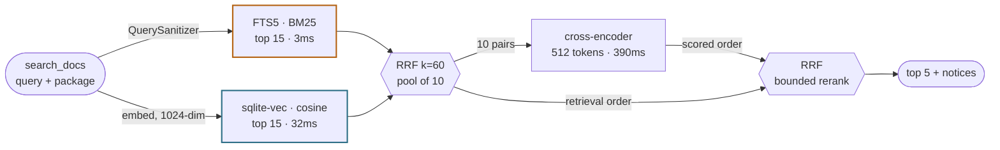

# Local Stdio MCP Server

A lightweight Elixir MCP server designed to run over `stdio` transport with a local SQLite database and an `AI_API_KEY`.

- `search_docs`: ask a question about an Elixir package; the tool answers from the local index, or downloads and digests the package first if it is not indexed yet. A first-time ingestion of a large package may exceed one tool call — the payload then reports progress and the job continues in the background.
- `list_indexed_packages`: what is indexed, at which version, whether it is complete, and how that compares to the version this project depends on.
- `remember`: save knowledge points (pattern, pain points)
- `recall`: check your knowledge database
- `search_gh_issues`: dig in a repo issues. This is not saved in the db.

> you can check your LLM helper consumption with `get_token_usage`.

## Tech

- `SQLite` + FTS5 + `sqlite-vec`
- `anubis_mcp`: Compatible with Claude Code, Cursor, and Google Antigravity CLI (`agy`).
- `MDEx` MarkDown parser, `lazy_html` (Lexbor) for older ExDcos version,
- `Bumblebee` to run the cross-encoding reranker
- Cloud AI models (embeddings, chat-small, chat-medium).

>[!IMPORTANT]
> It uses AI support for computing embeddings and chat completions; you must provide an **AI_API_KEY** and three models.

 |Tool                                                        | Embeddings (/embeddings)                                   | Chat Model (/chat/completions) |
  |--|--|--|
  | search_docs                                                 | Yes (embed / embed_batch)                                  | No |
 | search_hex_packages                                         | No                                                         | No |
 | search_github_issues                                        | No                                                         | No |
 | recall                                                      | Yes (embed)                                                | No |
 |  remember                                                    | Yes (embed)                                                | Yes (small & large for taxonomy & deduplication)|

<details>
<summary>Example of models</summary>

|Model|Mistral / cost|OpenAI /cost|Gemini /cost|
|--|--|--|--|
|Embeddings|mistral-embed 0.1 /M|txt-embedding-3-small 0.02 /M|text-embedding-004 0.025 /M|
|Fast extraction|mistral-small-4 0.15/0.60|GPT-5-nano 0.05,0.40 /M|gemini-2.5-flash-lite 0.10,0.40 /M|
|Classification|mistral-large-3 0.50/1.50|GPT-5-mini 0.25,2.00 /M|gemini-3.1-flash-lite 0.25,1.50 /M|

</details>

## Features

- **Hybrid search**: FTS5 and`vec_distance_cosine` selects candidates, rank-fusion merging process and final cross-encoding reranking.
- **Intelligent Knowledge Memory**: Multi-stage LLM curation pipeline (`decide`, `merge`, `append`, `discard`) powered by the LLM for deduplication and structuring.
- **HexDocs ingestion**: fetches a package's docs tarball from Hex, extracts it in memory, and indexes it with embeddings on demand. One HTTP request per package, never a page-by-page crawl.
- **Version-aware**: `latest` resolves to the version *this project depends on* when the package is a dependency, otherwise to Hex's latest stable release. One version per package is kept, so results never interleave versions.
- **GitHub issues** are queried live against the GitHub API and are *not* stored locally.

## Tools

| Tool | Description |
| ------ | ------------- |
| `search_docs` | Search one Hex package's documentation, typespecs, guides and examples. `package` is required; ingests on demand |
| `list_indexed_packages` | List indexed packages, versions, completeness, and the version this project depends on |
| `search_hex_packages` | Find *which* package to use — Hex.pm names, descriptions, download counts |
| `search_github_issues` | Live GitHub API search for issues and PRs in an organization (not indexed) |
| `remember` | Save a technical learning or pain point to the local knowledge base |
| `recall` | Search that knowledge base before re-investigating a failure |
| `get_token_usage` | AI token consumption recorded locally, by model and date range |

## Quickstart

### Prerequisites

- Elixir 1.20+
- [SQLite](https://www.sqlite.org/) installed
- [sqlite-vec](https://github.com/asg017/sqlite-vec) extension installed
- An AI API provider. You can test with a [Mistral](https://console.mistral.ai/) key with a generous free-tier. The MPC defaults to the Mistral models so only the keye is needed.

### Setup

Navigate to the stdio_mcp fork:

```bash
DATABASE_PATH="priv/mcp.db" mix setup
mix compile
```

Copy `CLAUDE.md` (or `AGENTS.md`)

### AI Code Assistant Configuration

**Claude Code / Cursor** (`.mcp.json`):

```json
{
  "mcpServers": {
    "hex_local": {
      "command": "sh",
      "args": [
        "-c",
        "cd /absolute/path/to/local_hex_mcp && exec /opt/homebrew/bin/mix mcp.server --no-compile"
      ],
      "env": {
        "MIX_ENV": "prod",
        "AI_API_KEY": "your-key-here",
        "PATH": "/opt/homebrew/bin:/usr/local/bin:/usr/bin:/bin",
        "DATABASE_PATH": "/absolute/path/to/local_hex_mcp/priv/mcp.db"
      }
    }
  }
}
```

**Google Antigravity** (`.agents/mcp_config.json`):

```json
{
  "mcpServers": {
    "hex_local": {
      "command": "mix",
      "args": ["mcp.server", "--no-compile"],
      "cwd": "/absolute/path/to/local_hex_mcp",
      "env": {
        "MIX_ENV": "prod",
        "MIX_QUIET": "1",
        "AI_API_KEY": "your-key-here",
        "PATH": "/opt/homebrew/bin:/usr/local/bin:/usr/bin:/bin"
      }
    }
  }
}
```

### Ingestion tuning

Set in the `env` block of your MCP config; they take effect on a server restart, with no recompile. A malformed value falls back to the default rather than raising.

| Variable | Default | Notes |
| --- | --- | --- |
| `INGEST_TIMEOUT_MS` | `25000` | How long a search waits for an in-flight ingestion. Must stay **below** the MCP transport's request ceiling (Anubis' session call gives up at 30s), or the request dies before the progress notice can be returned. |
| `EMBED_BATCH_SIZE` | `200` | Inputs per embeddings request. The provider limits *requests* per second, so larger batches reduce 429s. The real ceiling is tokens per request, but a token-limit rejection is bisected automatically, so this rarely needs tuning. |
| `EMBED_CONCURRENCY` | `2` | Concurrent embedding requests. Bounded by the Finch pool and the provider's rate limit — not by CPU count; the work is IO-bound. |
| `EMBED_PAUSE_MS` | `0` | Pause after each embedding request, for providers that limit requests per second. `0` means no pacing. Raise only if 429s persist after lowering concurrency. |

> Changing code requires `MIX_ENV=prod mix compile` **and** reconnecting the MCP server — recompiling alone does not reload modules into a running BEAM.

### Telemetry

The tool `get_token_usage` returns the token consumption.

The query:

```bash
get_token_usage(from: "2026-08-01", until: "2026-08-01")
```

returns a clean human-friendly Markdown

<details>

<summary>example</summary>

```json
    {
      "total_requests": 12,
      "total_tokens": 10450,
      "total_prompt_tokens": 8200,
      "total_completion_tokens": 2250,
      "period": {
        "from": "2026-08-01",
        "until": "2026-08-01"
      },
      "by_model": {
        "mistral-embed": {
          "requests": 8,
          "prompt_tokens": 6500,
          "completion_tokens": 0,
          "total_tokens": 6500
        },
        "mistral-small-latest": {
          "requests": 4,
          "prompt_tokens": 1700,
          "completion_tokens": 2250,
          "total_tokens": 3950
        }
      }
    }
  ```

</details>  

### Optional: Litestream replication

Replicate your SQLite database to cloud storage (S3, B2, etc.) for backup and portability.

1. Install [Litestream](https://litestream.io/install/)
2. Configure replication for `DATABASE_PATH`

### Misc: Knowledge Decision taxonomy

| Action | When | What happens |
| ----------- | ------------------------------------------------------- | --------------------------------------- |
| **create** | No similar neighbors (similarity < 0.7) | New entry |
| **discard** | Too similar (> 0.9), no additional value | Do nothing |
| **append** | Similar neighbor, new info adds value | Concatenate to existing content |
| **merge** | Overlapping but complementary info | Synthesize old + new into one entry |
| **replace** | Old info is factually wrong/superseded | Replace content of existing entry |
| **deprecate** | Neighbor is outdated by new info | Mark old as `outdated=true` |

## Search engine

A query runs three stages: two retrieval arms in parallel, reciprocal rank
fusion, then a cross-encoder whose verdict is fused *back* against the retrieval
order rather than replacing it. Roughly 400ms end to end.



**Fusion happens twice.** The first pass unions the two arms — a *union*, not an
intersection, so a document the keyword arm never matched can still be returned.
The second pass fuses the cross-encoder's ordering with the one retrieval
produced, so the model can move a document but not overrule the search outright.

Concretely, the second fusion is **rank averaging**: both inputs hold the same
ten documents, so each contributes `1/(60 + rank)` twice and the result orders by
something very close to the sum of the two ranks. Nothing cleverer than that.

The case it was built for: on `"prevent interception of the authorization code on
a public client"`, all three retrieval arms put boruta's PKCE guide at rank 1 and
the cross-encoder dropped it to 8, preferring a typespec that lists
`pkce: boolean()` among thirty fields. Averaging the two rankings puts it back
at 2.

**How well this generalises is not established.** Against the 26-query set,
fusing rather than letting the cross-encoder win outright moves 9 queries: five
improve, four worsen, and every movement is one rank except the PKCE case that
motivated the change. Remove that query and the effect is exactly zero. The
aggregate difference (recall@5 0.92 → 0.96) is one query, and one standard error
at this sample size is 0.043 — so the number is indistinguishable from noise.

It is kept on the mechanistic argument rather than the measurement: a bi-encoder
and a cross-encoder fail differently, so averaging their ranks is the standard
response to two rankers with uncorrelated errors. Treat it as unvalidated until
the query set is large enough to test it.

### Query, step by step

1. **Embed the query** — one API call, 1024 dimensions. The only network hop in a
   warm query.
2. **Ensure the package is indexed** — an unknown package triggers ingestion
   inline (below); a known one costs one row lookup and no network.
3. **Verify the embedding model** — if the index was built by a different model,
   the vector is dropped and a notice says so. Vectors from two models are not
   comparable: different widths make sqlite-vec raise, identical widths return
   noise while raising nothing.
4. **Scope** — package, version and the examples-only filter are applied to a
   base query that *both* arms join, so the depth budget is never spent on other
   packages.
5. **Keyword arm** — `QuerySanitizer` quotes each term as an FTS5 phrase and
   expands identifier-shaped terms into joined *and* split forms, so
   `Boruta.Oauth.token/2` searches for the exact symbol and its parts. BM25 order,
   top 15.
6. **Vector arm** — cosine distance over the scoped rows, top 15. This is the arm
   that bridges vocabulary gaps.
7. **Fuse to ten** — each arm contributes `1/(60 + rank)`; an absent document
   contributes nothing.
8. **Hydrate in fused order** — `id IN (…)` returns storage order, so the ranking
   is reimposed before the reranker sees it.
9. **Rerank** — the cross-encoder reads each query/document pair together and
   emits one relevance logit; the result is fused with step 7's order.
10. **Return five.** The pool is ten; returning all of it hands back exactly the
    tail the reranker just demoted.

### Ingestion

Runs inline on the first search naming a package. One HTTP request for the docs,
nothing written to disk.


Notable decisions:

- **A stored version that differs from the current release is reported, never
  silently replaced.** Auto-switching would let one unpinned search discard a
  pinned version and force a full re-embed to get it back.
- **The model guard runs before the download.** A mixed-model index cannot be
  repaired by searching harder, and refusing costs one row read where proceeding
  costs a tarball plus a full re-embed.
- **Chunking is structural, not byte-based.** Boundaries fall on headings, then
  blocks, then list items, with a byte splitter kept only as the floor for a
  single oversized code block. Navigation sections — link lists made of the very
  titles people search for — are dropped. Nothing overlaps: text is sliced from
  the original markdown by source position, so what is stored is byte-identical
  to what the package published.
- **Embedding failure aborts before a single row is written.** Rows without
  vectors produce an index that looks complete, passes every count check, and is
  invisible to semantic search.

### Why the depths are what they are

Every number was measured against a fixed 26-query set (`mix docs.eval`). Three
are counterintuitive.

| Setting | Value | Why not more |
| --- | --- | --- |
| per-arm depth | 15 | Deeper is **worse**. RRF scores agreement, so at depth 40 an item ranked ~15 by both arms (`1/75 + 1/75`) outscores one ranked 3rd by a single arm (`1/63`), and the strong single-arm hit falls out of the pool. recall@5 drops 1.00 → 0.96 purely by retrieving more. |
| rerank pool | 10 | Retrieval wants depth; reranking does not. Candidate recall is already 1.00 at ten, so everything beyond is a distractor the model can mis-promote and nothing it can find. |
| sequence length | 512 | At 128 the pair truncates to ~400 characters. Symbol queries survive — the identifier is in the header — while conceptual answers sit deeper in the chunk and are never seen. Reranking at 128 scored *worse than not reranking at all*. |

Two properties worth knowing before trusting a measurement:

- **BM25 is corpus-global.** FTS5 uses collection-wide document frequency, so
  indexing any package shifts the keyword ranking of queries in *other* packages
  — measured, 53 new rows moved the keyword arm by 0.04 with nothing else
  touched. Vector search is immune. A control table is only valid for the corpus
  that produced it, which is why the report prints a corpus fingerprint.
- **Bigger rerankers are not better here.** `bge-reranker-base` (278M) scores
  0.78 MRR against MiniLM-L-6's 0.79 and is five times slower;
  `ms-marco-MiniLM-L-12-v2` loses two queries outright. Selectable via
  `AI_RERANK_MODEL`.

### When a stage fails

Every stage degrades to the one beneath it. None is an error the caller handles.

| Condition | Behaviour |
| --- | --- |
| No API key, or the index was built by another model | Keyword search alone, with a notice naming the fix |
| Cross-encoder not loaded, or its output unrecognised | Fused retrieval order, logged |
| Keyword terms match nothing | The vector arm carries the fusion alone |
| Both arms empty | No results — not an exception |
| Ingestion outruns the request budget | A progress notice; the job keeps running and the next identical search collects it |

### Measured

26 queries — 14 conceptual, 12 bare identifiers — over 10 packages and 2,755
chunks. `cand` is the share of queries whose candidate pool contained the answer
at all, and is the ceiling on everything downstream.

| Strategy | recall@5 | MRR@10 | cand | ms |
| --- | --- | --- | --- | --- |
| keyword only | 0.88 | 0.67 | 0.96 | 3 |
| vector only | 0.88 | 0.76 | 1.00 | 32 |
| intersection (previous design) | 0.92 | 0.79 | 0.96 | 31 |
| fusion | 0.92 | 0.76 | 1.00 | 28 |
| **fusion + bounded rerank** | **0.96** | **0.79** | **1.00** | **398** |

Split by query shape the last row reads very differently: `1.00 / 1.00` on bare
identifiers, `0.93 / 0.60` on conceptual questions. The reranker pulls
conceptual answers *into* the top five that retrieval missed, while ordering them
worse than plain retrieval does. Bounding its authority recovered the recall; the
ordering gap is the open problem.

Reproduce with `AI_API_KEY=... mix docs.eval --verbose`. A change that does not
move these numbers did not work, whatever it looked like in a spot check.

### On the latency budget

400ms is not instant, and that is fine — but not for the reason it first appears.

A single assistant turn is seconds of token generation, so 400ms is noise against
it. The mechanism that actually matters is not a gradient of patience but a
**hard wall**: Anubis' session `GenServer.call` gives up at 30s and the client has
its own tool timeout. Below the wall, latency costs nothing behavioural; above it
the call dies. So the tail is what needs protecting, not the median — a 400ms
median with a 26s cold-ingest tail is a worse risk profile than a 900ms median
with a 3s tail. That is why `INGEST_TIMEOUT_MS` sits at 25s with a progress
notice, rather than the pipeline simply being fast on average.

What justifies spending latency is that cost compounds through **retries**, not
through the call. If the tool answers, the agent moves on; if it does not, the
agent reformulates — a second tool call plus a whole extra model turn. A 400ms
call that answers is much cheaper than a 50ms call that forces a second turn.
Against that, the reranker's 390ms buys recall@5 from 0.92 to 0.96: one query in
26 that no longer needs a retry. If a retry costs ~3s of model turn, it pays for
itself above roughly a 4% retry-avoidance rate, and 0.04 is what was measured.

The operating rule, then, is close to the opposite of "keep it snappy": **spend
the median freely up to the wall when it buys correctness, and protect the tail
absolutely.** Concurrency is not a factor, and not for the reason you might
expect: an Anubis session holds one request in flight and queues the rest, so
parallel tool calls are serialised before they ever reach the reranker. What that
does mean is that a slow request consumes the timeout budget of everything queued
behind it — see "One call at a time" below.

## Worked examples

Both of these are real questions from a session where the answer was genuinely
unknown, and both are now regression queries in `mix docs.eval`. You do not call
the tool yourself — you ask a normal question and the assistant decomposes it.

### A question with no answer in your training data

```txt
can an MCP server ask the client's LLM to run a completion, and does
anubis support it?
```

The assistant issues one call, using the vocabulary the package's own docs would
use rather than the words in the question:

```elixir
search_docs(package: "anubis_mcp",
            query: "server requests a completion from the client model, sampling create message")
```

It returns `Anubis.Server.send_sampling_request/2` (server side),
`Anubis.Client.register_sampling_callback/2` (client side), the guide section
that explains sampling alongside roots and elicitation, and the callback's return
shape — with a citable `hexdocs_url` on each.

### A question whose answer shares no words with it

```txt
how do I check the client declared a capability before sending it a request?
```

```elixir
search_docs(package: "anubis_mcp",
            query: "check whether the connected client declared a capability before sending a server request")
```

Rank 2 is `Anubis.Server.send_elicitation_request/3`, whose docstring happens to
carry the rule for *all three* server-initiated request kinds:

> The client must advertise the `elicitation` capability or the call returns
> `{:error, :capability_not_supported}` after enqueueing.

Nothing in the query lexically matches that function — no shared identifier, no
shared phrasing. That is the vector arm doing the one thing BM25 structurally
cannot, and it is the case the whole hybrid pipeline exists for.

### What it does not tell you

Both answers above are correct. Extrapolating from them was not: the docs say
`roots` is supported and Claude Code advertises it, so sending a `roots/list`
request looks safe — and it deadlocks the stdio transport in anubis_mcp 1.14.0,
because `ServerRequests.send_to_transport/3` calls back into a transport already
blocked on the session.

`search_docs` tells you what a library **says**, reliably and with a citation. It
cannot tell you what it **does** under your transport, at your concurrency, in
your session. Interactions between processes are in no docstring.

### One call at a time

An Anubis session holds one MCP request in flight and queues the rest
(`Session.Scheduler.enqueue_or_dispatch/5` dispatches only when `in_flight` is
`nil`). Tool calls are therefore serialised, and issuing several in parallel buys
nothing.

It costs something, though: the transport's `GenServer.call(session, …, 30_000)`
starts its clock when the request is *sent*, not when it is dispatched, so a slow
request burns the budget of everything queued behind it. A 25s ingest leaves a
queued search roughly 5s before its own transport call times out. This is the
main reason `INGEST_TIMEOUT_MS` sits below the transport ceiling rather than at
it.

For tools called repeatedly in one turn — `remember` especially — take an array
and iterate inside a single call rather than relying on parallel invocations that
cannot happen.

### Multi-package questions

A search is scoped to **one** package, so a question spanning several becomes
several calls, each written in that package's own vocabulary:

```elixir
search_docs(package: "anubis_mcp", version: "1.14.0",
            query: "StreamableHTTP Plug router forward authorization")

search_docs(package: "boruta", version: "3.0.0-beta.4",
            query: "authorize access token bearer Plug protect resource")
```

Sending the same sentence to both matches neither well. Any package not already
indexed is downloaded, chunked and embedded first.
